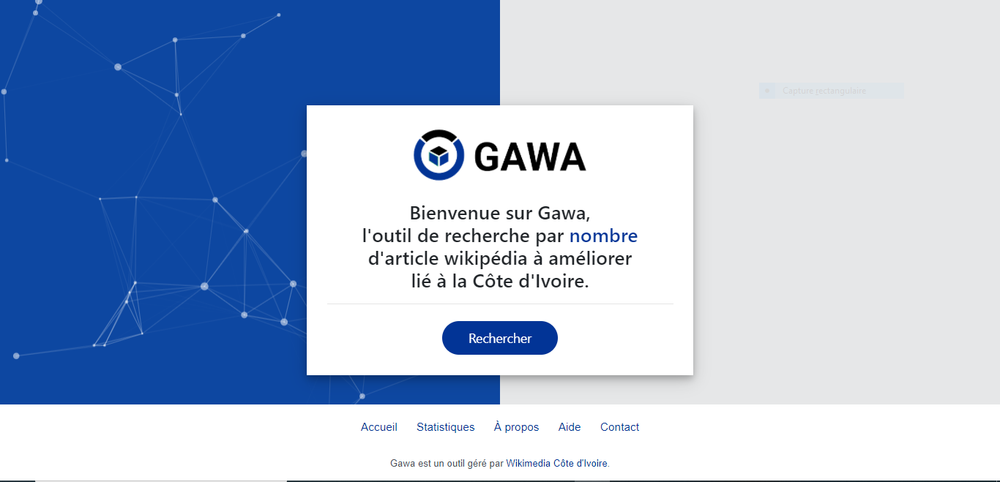

# GAWA (un outil de Wikimedia Côte d'Ivoire)



GAWA (signifiant Générateur d'Articles Wikipedia à Améliorer) est outil développé et géré par l'équipe de développeurs de la communauté [Wikimedia Côte d'Ivoire](https://wikimedia.ci/).
GAWA est un outil de détection et de génération d’article wikipédia à améliorer de [Wikimedia Côte d'Ivoire](https://wikimedia.ci/). Ce logiciel se focalise actuellement sur les contenus éducatifs ivoiriens de l’encyclopédie libre en ligne [Wikipédia](https://fr.wikipedia.org/wiki/Wikip%C3%A9dia:Accueil_principal).
L’ancienne et première version de l’application, créée en mi-mars 2019, a été développée avec le langage Python (version 3) et le Framework Flask. En 2020, précisément dans la période de mai à juillet, un premier Hackathon de l’application GAWA a été organisé avec l’appui de Wikimédia Côte d’Ivoire. Et celui-ci a permis de travailler sur une seconde version de l’outil avec l’ajout d’une nouvelle fonctionnalité comme la page web de statistiques.
Depuis mai 2021, GAWA a redémarré dans une nouvelle ère numérique. Il a été classé comme premier outil du projet technique de la communauté des user group ivoirien, dénommé WIKIHACK (projet de création d’outil technique pour l’amélioration de ressources Wiki qui naquit en 2021). Ici, nous parlons de nouvelle et troisième version de l’application, car elle a changé de technologie : l’entièreté de son code source (auparavant écrit en Python avec le Framework Flask,) a été réécrit en PHP (version 8) avec le Framework Symfony. Avec ce changement technique, l'équipe des développeurs de l’outil travaillent sur les nouvelles fonctionnalités de celui-ci.


### Clone project

```$ git clone https://github.com/paulbouaffou/gawa```

## Contributor

* [Paul Bouaffou](https://github.com/paulbouaffou) - Project Lead

## License

This project is open source and available under the [MIT License](LICENSE).